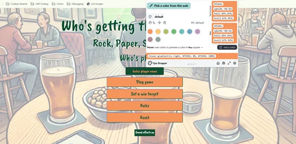
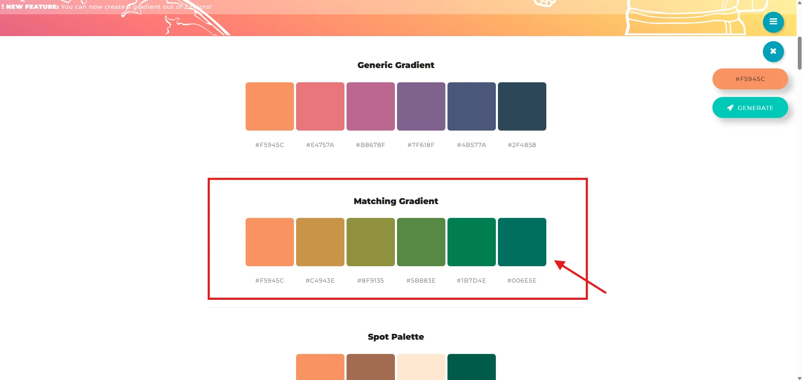
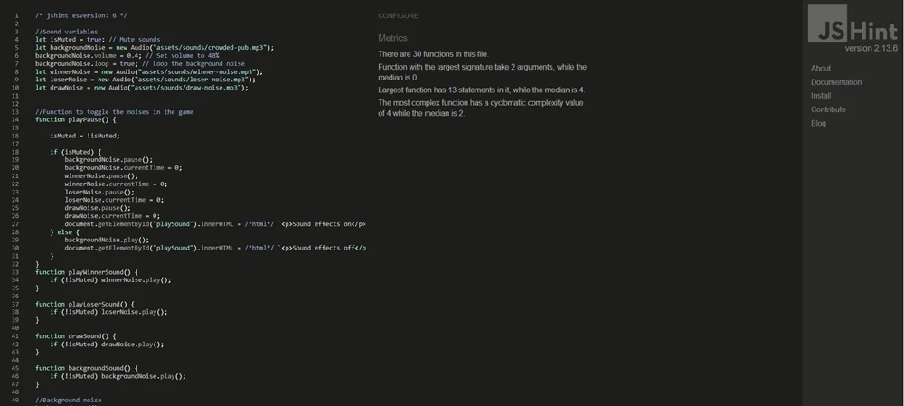
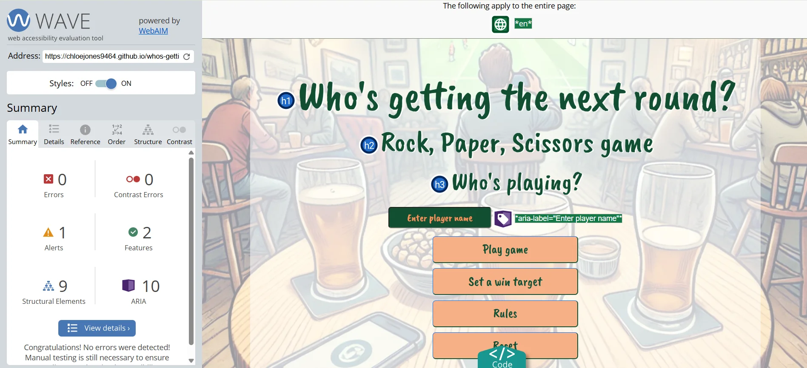

# Who's Getting The Next Round?

Ever needed to make a decision on who's getting the next round of drink in from the bar?
Look no further! Here is a fun, quirky game for you to enjoy while at the pub, at home or...anywhere really!

I've created a game that can be played by anyone of all ages. I want the game to provide fun, enjoyment and entertainment for all players.
You can expect a funny paragraph at the end of each round if you've won, lost or had a draw with your mate!
Even if you haven't got a scooby-doo about the game of Rock, Paper, Scissors, I've put the rules on both home and game pages!

Growing up, I've always enjoyed this game whether its making decisions or curing a period of boredom. It was a big part of my childhood.

---

## Table Of Contents:
1. [Design & Planning](#design-&-planning)
    * [User Stories](#user-stories)
    * [Wireframes](#wireframes)
    * [Typography](#typography)
    * [Colour Scheme](#colour-scheme)

    
2. [Features](#features)
    * [Navigation](#navigation)
    * [Other features](#other-features)

3. [Technologies Used](#technologies-used)
4. [Testing](#testing)
5. [Bugs](#bugs)
6. [Deployment](#deployment)
7. [Credits](#credits)

## Design & Planning:

### User Stories

[Here](userstories.md) you'll find the user stories for my project; I have combined the HTML and JavaScript user stories.

This page contains links to my user stories in my GitHub project and will have corresponding screenshots/screen recordings of the completed tasks.

---
### Wireframes
Please follow this link to the Wireframes.

Click [here](wireframes.md) and it'll take you straight there!

---
### Typography
I used Google fonts' "Caveat Brush" for the one and only font for this game. It's a playful and fun font that fits well with a game that is casually played where-ever, whenever and in any decision-making process!

---
### Colour Scheme

#### ColorSpace and Eye Dropper
I used the eye dropper on the image in the background of the front screen and passed the color I'd like to create a palette from, through to ColorSpace.
I then scrolled through to find the best palette for my project. In this case it was "Matching Gradient".

---

#### Eye dropper tool in Chrome's extension

---
#### ColorSpace color palette. I used the "Matching Gradient" palette

---
## Features:

### Navigation
The navigation within this game is very simple and straight-forward. 

The home page has an input field followed by 3 buttons.
Play game button takes you straight into the game page.
Set a win target button is there for the player to choose if they would like to make the get as long or short as they'd like.
The rules button pops a modal out of the screen over the page for the player to refresh their knowledge of the classic game.

The game page has a total of 5 buttons.
The main menu button takes you back to the home page.
The rules button, like the main menu rules button, will pop out a modal for the player to read.
The 3 hands at the bottom of the play area are buttons for the player to press to play the game.

The winner/loser/draw pages contain 2 buttons that will ask the player to choose to play again or to return to the main menu.
The play again button will take the player back to the page with the same set wins target as they chose on the home page.
The main menu button takes the player to the home page and will clear the set win target and give the player to choose another if they'd like to up or lower it.

---
### Other features

#### .innerHTML
I have a specific feature that I'm incredibly proud of, and that is the transitioning to and from the game page.
I used a lovely trick that my mentor taught me, that is to manipulate the DOM and change the .innerHTML of the divs on the index.html. This worked so well for the project and using this method has helped improve the performance by cutting out the loading of another page.
It makes the project feel sleek.

#### Sound effects
Another feature that I quite like, though not as much as the first, is the sound effects added to the game.
I love that the game has another layer to it, having sound adds a more enjoyable experience. Giving the feel of being in the pub, celebration cheers for when you win, a sad sound for when you lose and a funny voice sound effect for when you draw. There is an option to turn the effects on at the bottom of the page, on every page, so if the player has had a gutful of hearing the quirky sound effects, they can switch it off.

## Technologies Used
For my project I used; 
* HTML and CSS for the structure of the project.
* Bootstrap helped create a different effect for my buttons. I made sure to put my own spin by changing the color, font and added a border-bottom/right style to create a 3D effect.
* GitHub is used to store and build my project, the BEST!
* I used Google fonts for a more playful font that'll pair well with my concept (laid-back pub vibe).
* JavaScript
* I used an extension within VSCode that enable me to view my project live as I am designing, styling and coding. This extension is Live Preview.

## Testing

Here we go! The most important part of this README and one that I have a love/hate relationship!

### Manual and Automated testing

#### Manual testing
Manual testing is checking your project against user stories and testing through the browser with different browser resolutions, responsiveness and design in mind. Also known as "user testing". 
* There comes some cons with this form of testing as it's;  
* Time consuming having to check each and every element to see if it works the way you'd like. 
* Resource hungry, if the project is of a certain size then it will need a large team to test and work on it. 
* High error rate as there may be blind spots in the code, small errors missed and the team's biases could play a part also.

#### Automated testing
Automated testing used code to test code. There are many pros to this as;  
* It quicker! - 100's of tests can be run over a short amount of time.  
* Early error detection - tests are written by the programmer as the project is being developed, so errors are picked up very early into the project. 
* This form of testing can be beneficial as it can perform very specific testing. 
As with everything, automated testing has it's cons. Tests are only as good as the questions you're asking, you NEED to be clear in what you'd like to test! 
This is a big one that I believe is very very important, it doesn't test the user experience. If you'd like your project to perform in a certain way and you'd like to visually see it, it may not be great to use this form of testing.

### Google's Lighthouse Performance
Follow this [link](lighthouse.md) to view the Google Lighthouse Performance on mobiles and desktops!

---
### Browser Compatibility
When testing different browsers, I used screen recording so that you can see the responsiveness and compatibility across browsers such as; Chrome, Internet Explorer, Firefox, Opera and Safari.

Please click the link below to view the testing.

---
### Responsiveness
I've used screenshots and screen recordings in my user stories that show the games responsiveness for each element of this project.
The screenshots/screen recordings show responsiveness on devices such as; Mobile(320px), Tablets, Laptops and screens of 1080p.

 Please follow this [link](userstories.md) that will take you there.

---
### Code Validation
This [link](validation.md) will take you to the screenshots of the validation checks I'd run for all my pages.
There were a few minor errors that popped up but was mainly the duplicate of ids and the background image in the body tag.

This dropdown will show you the screenshot of the JSHint checks of my script.js.

JSHint

---
### WAVE Evaluation
I used WAVE to ensure I have the best possible accessibility features in my game so anyone can play and enjoy!  
There is an alert about the noscript tag. There was no action needed for this as I want to keep it on the page.

Here is the screenshot of the checks;

WAVE Evaluation

---
### Manual Testing user stories or/and features
Please find the visual testing in the following link;
[User story testing](userstories.md)

User Story |  Test | Pass
--- | --- | :---:
As a player, I want a main menu that is has a clear structure so that I will be able to navigate the page with ease. | The user will see the main page with good contrasting colors, easy navigation to play the game, choosing the number of turns they'd like to take and the rules that will pop out in a modal with clear, funny and informative detail of the game. The user is able to click on the play game button to display the game page, click on the number of turns button to adjust how many games they'd like to play, click the rules button to display the rules modal and enter their name in the input above the buttons| &check;
--- | --- | :---:
As a player, I want to have a choice of a number of games to play so that I can pick one that's best for me. | There is a clear button on the home page for the user to choose the 'best of' number of turns until they win. This is in place to give the user the element of control and for them to decide what works for them. They will be able to change the number of turns before the game end with the winner reaching the number chosen by the user. | &check;
--- | --- | :---:
As a player, I would like to have instruction to the game so that I understand how the game works.| The instructions/rules button is placed at the bottom of the main menu and is clearly labelled should the user need to give it a read. Once the button is clicked, a modal pops up over the page to show the rules of the game. This is also available on the game page if the player needs a refresh of the rules. | &check;
--- | --- | :---:
As a player, I would like to have the game page to be easy to look at so that I won't have trouble playing the game. | From the main menu, once clicking on the play game button, it will take you to the game page. This is displayed by changing the content of the divs on the main page, making the page's loading time a lot quicker! The player is able to start the game immediately. Once the player clicks on their choice the computer's choice will display the same time, giving an instant result. There is a scoreboard above the game area, displaying all scores from the player, computer and the draw score. The main menu and rules button is place at the top right if the screen and is visible on small and larger devices throughout the time on that page.| &check;
--- | --- | :---:
As a player, I would like to see the end result of the game so that I can see if I've won, I can CELEBRATE or if I've lost, I'll drown my sorrows. | When the game is won/lost/draw, the screen will change to the display of the result of the game. There will be a winner, loser and a draw page containing a quirky and funny paragraph, the option to play again or to return to the main menu. The user will feel like they have completed the game and have the control to leave or play another game. | &check;
--- | --- | :---:
As a player, I want to see my name in the game, so that the game is more personal to me. | On the main menu of the page, the player can enter their name (no more than 15 characters). The player's name will then appear in the paragraph on the winner/loser/draw page. | &check;
--- | --- | :---:
As a player, I want a main menu button on the screen (on the game page), so that I can return to the main menu whenever I'd like. | The game page will contain a navbar that will hold the main menu and rules button. The main menu button, once pressed, will clear the HTML of the game page and revert back to the original content. This will ensure seamless transition and cleaner code. | &check;
--- | --- | :---:
As a player, I want a button for the rules, so that I can be reminded of the rules at the beginning, or mid game or whenever needed. | The rules button will sit at the top of the screen like the main menu button. The rules button, same as the main menu page, will display a modal over the game page. Players can expect to open the rules modal and exit by the close or X button or simply clicking outside the modal itself. | &check;
--- | --- | :---:
As a player, I want to see the score of the game, so that I can see if I'm winning/losing, or the game comes down to a draw. | The scoreboard will contain the player's, computer's and the draw score. Each will have a function that will be called to increment the score if the game logic is met for each one. The player will see their score increase by 1 if they win, computer increase by 1 if they lose and the draw score would increase by 1 if both chose the same hand. | &check;
--- | --- | :---:
As a player, I want to see what the computer chose, so that I can see what we've both chosen. | The player can expect to see an area on the screen where the computer's choice will be displayed. This will give a visual of the computer's choice for the player. | &check;
--- | --- | :---:
As a player, I want to have a visual results display, so that I can read if I've won, lost or drew in the round. | The results display will contain a small line to tell the player who's won the round. The player can read the display clearly and instantly as soon as they click on the hand.| &check;
--- | --- | :---:
As a player, I want a player section, so that I know where I need to click the hands and play the game. | The player can expect to find their hands for the game to be at the bottom of the play area. They can click on the hands for instant results of the game. If the player is playing on a desktop, they can expect to see the cursor and hand change as they hover over them. | &check;
--- | --- | :---:
As a player, I want an end of game page, so that I can see if I've won, lost or drew in the game. | The player can expect to see a page appear after each "set win target" is met. They will have a personalised message for if they win/lose/draw, thanks to the input on the main page. This will give the player a sense that the game has ended but will have the option to play again or return to the main menu. | &check;
--- | --- | :---:
As a player, I want fun sounds played in the background, so that I get the feel of being in a pub. | The sounds in the game are a crowded pub, applause, loser noise and draw noise. The main sound of the game will be the crowded pub noise as it plays throughout the game. When the player wins, they will receive a round of applause, if they lose, they will receive an "awww" noise and if they draw, they will receive an "ahh interesting" noise. | &check;
--- | --- | :---:
As a player, I want to have a Reset button in the main menu, so that I can reset my name and set a win target for future games. | The player will see a button labelled "Reset" at the bottom of the menu. Once clicked, the button will display a modal that will pop-over the menu screen. In the modal, there will be a small sentence asking if the player would like to reset the data they've entered into the game (Name and Set a win target). There will be an option to confirm or cancel the request. If the player clicks to "Reset", both their name and Set a win target will be set to the default setting. | &check;

## Bugs

### Getting the background image to fit the whole screen
I applied the background image to the HTML page as I'm going to change it when the 'Play game' button is clicked. I then tried working out how to position the image centre and so there wasn't any gaps at the bottom of the page. To do this I applied the following code: **background-position: centre centre** & **background-attachment: fixed**. This helped position the image in the centre of the screen and the attachment is set to fix so that the image stays where it is.

---
### Google Fonts
After completing my first project and learning about JavaScript, I'd let my knowledge slip a little on how to import the fonts I'd like from Google Fonts and pop them into my project.
I'd placed the import line of code in the CSS stylesheet as usual, but I'd also copied and pasted the link to put into the head of the HTML page. After realizing what I'd done. I deleted the link in the HTML and kept import in the CSS stylesheet. I'd then noticed that the font-family was placed in the HTML element on the stylesheet. I placed that style in the body element instead. The font worked perfect after that, thank God!

---
### Git conflict
I received an error displaying;
To https://github.com/chloejones9464/whos-getting-the-next-round.git
 ! [rejected]        main -> main (non-fast-forward)
error: failed to push some refs to 'https://github.com/chloejones9464/whos-getting-the-next-round.git'
hint: Updates were rejected because the tip of your current branch is behind
hint: its remote counterpart. If you want to integrate the remote changes,
hint: use 'git pull' before pushing again.
hint: See the 'Note about fast-forwards' in 'git push --help' for details.

I copied this error into Google and GitHub Docs came to my rescue.
I had to pull my repo using this code; *git pull origin YOUR_BRANCH_NAME*, which pulled up another error.

Second error showing this;
$ : The term '$' is not recognized as the name of a cmdlet, function, script file, or 
operable program. Check the spelling of the name, or if a path was included, verify that    
the path is correct and try again.
At line:1 char:1
+ $ git pull origin main
+ ~
    + CategoryInfo          : ObjectNotFound: ($:String) [], CommandNotFoundException       
    + FullyQualifiedErrorId : CommandNotFoundException

Silly me for leaving the $ symbol in the code!
Removed the code and then, lo and behold, another error!!

Third error showed; 
From https://github.com/chloejones9464/whos-getting-the-next-round
 * branch            main       -> FETCH_HEAD
Auto-merging winner.html
CONFLICT (content): Merge conflict in winner.html
Automatic merge failed; fix conflicts and then commit the result.

I then fixed the conflict in the winner page and successfully manages to push my updates.
That was stressful...

---
### #mainMenu issue
I was working on the pages Winner and Loser ready to move onto my JavaScript element of the project when I flicked over to the home page to find that the background and styles were all over the shop!
I looked for the problem and found that the #mainMenu was used on the home page and for the button to take you back there on the Winner and Loser pages. To fix the issue, I created a class for the button with the styles in it and voila, Back to normal.

---
### Validator for HTML pages
The validator pulled up the background image I'd placed in the body tag.
I corrected this by putting the styling in the style.css sheet, but I came across an issue. there was no background image!!
I searched online and used the help from Stack Overflow, I took the "" out of the path to the image. Still no image! I then removed assets and replaced with .. and re-added the "" to the path.....BOOM, image!
I went on to change this on the game, winner, loser and draw pages.

---
### Event listeners!!
I couldn't, for the life of me, think how to connect the event listeners to the game page. So, I reached out to my fab mentor Matt for a little guidance. He'd explained in detail about why we need to call the event listener function in the playGame() function.
Matt also helped debug a function that was in my code during our call.
The code wasn't registering the computerChoice function because I was comparing playerChoice and computerChoice when the computer was declared a variable with the value of computerChoice. This was changed, tested and all worked perfectly.

---
### Changing the HTML to the winner/loser/draw pages content
I was working on getting the content to show for when a player/computer wins or whether there was a draw. I'd managed to get this working but then had an error pop up in the console; 
"Uncaught TypeError
playerWinPage
playerWin
roundResults
displayResults
playerHasChosen
HTMLDivElement

I had to change the ids on the play again button and menu button. This corrected the issue as they had the same id and clashed.

---
### Close game function
I had a close game function in my code at the very beginning of my project but then researched that I'm unable to close the window through the function.
This is because the function can only work if the game was opened via JavaScript. With this in mind, I decided to remove the code from the game.

---
### btn class from Bootstrap
The button, when hovered over, was showing the classic Bootstrap blue background and white text. This was an issue as this did not tie into my color scheme and would look out of place.
I did a little research and found from Quora that I was able to alter the button hover state and place an important at the end of each style, this ensured that the Bootstrap styling is overwritten.

---
### Dodgy commit
I'd spend days trying to work out the JavaScript for the first element of the game and after working at it for quite some time, I forgot to commit in-between my development! I went on to delete the code and add it back in bit by bit and commit each time so that the commit is much smaller and traceable.

---
### Grabbing the username
I found this part of the project quite difficult. I wanted to use the username in the paragraphs I'd made for when the player wins, loses or has a draw with the computer. I tried everything from websites to ChatGPT!
In the end, I combined the both to get the outcome I desired.
I created a function that I would call at the loading of the front page then I called it again when returning to the main menu page.
It's safe to say I deserved my Gin and takeaway that night!

---
### JSHint 

I've chosen to use the JSHint to check my JavaScript. This site is easy to use and I'm able to read and understand if an error or warning occurs in my code.
So, I ran my code through the site, and they pulled up 52 warnings. Scratching my head wondering what I'll need to do to get rid of these errors, they looked like this: 'let' is available in ES6 (use 'esversion: 6') or Mozilla JS extensions (use moz).
I used ChatGpt to help me understand why this is happening and if there were anything I would need to do to resolve it!
I simply needed to add the line /* jshint esversion: 6 */ to the beginning of my code to show the site that I'm using an ES higher than 5.

## Deployment

#### Deploying on GitHub
The site was deployed to GitHub Pages using the following method:
- Go to the GitHub repository.
- Navigate to the 'settings' tab.
- Using the 'select branch' dropdown menu, choose 'main'.
- Click 'save'.

#### Cloning
To clone a repository from GitHub, you can use the command git clone in the terminal or use the Clone Repository button in a tool like Visual Studio Code or GitHub Desktop. 

#### Steps 
1. Go to the repository's main page on GitHub
2. Click Code above the list of files
3. Copy the repository's URL
4. Open the terminal
5. Change the current working directory to where you want the cloned directory to be
6. Run the command git clone <repository-url>

#### How to fork the repository
To fork a repository on GitHub, navigate to the desired repository on GitHub, then locate the "Fork" button in the top right corner of the page and click it; this will create a copy of the repository under your own GitHub account, allowing you to make changes independently from the original project. 

#### Key steps:
1. Go to the repository: Access the GitHub repository you want to fork. 
2. Click "Fork": In the top right corner of the repository page, find and click the "Fork" button. 
3. Confirm ownership: If prompted, select the owner (which should be your GitHub account) for the forked repository.

## Credits
* I used ChatGPT and Microsoft Copilot to help create unique imaged for my project's background. I also used these for help with parts of my coding. Asking for them to explain certain parts of my code and why they work and do what they do.
* GitHub Docs
* W3Schools - I used this site quite a lot to check my knowledge and for help with sound effects. This really simplified my issues and helped me understand certain things a little more such as loops.
* Bootstrap - I used Bootstrap to help design buttons and structure my application.
* Google - The GOAT of all search engines, in my opinion. There in a flash and helped solve small issues.
* Flaticon - Rock, Paper, Scissor hands
* ColorSpace - I used this website to help pick the color palette for my project. It made a palette that fitted the background and compliments the application nicely.
* Pixelied - This helped convert PNG - WEBP
* Google Fonts - I used Google fonts a for a fun font to match the concept of the game itself.
* Favicon - I created an image using ChatGPT and then made the image into a Favicon for my project.
* Geekforgeeks - Helped me with my range slider development.
* Pixabay.com - I had the sound effects from this website for my game.
* JSHint - I used this site to check my JavaScript code.
* Am I Responsive? - I used Am I Responsive? to display my project as a hero image in my README.
* Word - I used Microsoft Word to spell check this README.
* Autoprefixer CSS - I used this website to ensure better cross-browser compatibility without requiring you to manually write prefixes like -webkit-, -moz-, -ms-, or -o-.

  - Code & Text Content
  
  - Media
    - YouTube - I used YouTube to help display my videos(screen recordings) in my README. When I used screen recordings for my previous project it had a very good review as you could see the responsiveness and testing "live in action". I was excited to use this feature again for this project.
  
  - Acknowledgment
    - A HUGE thanks to my family for being their patient selves while I spent hours each evening perfecting certain elements of this game. They've been my rocks and the reason for me to continue this coding journey!
    - Another HUGE thanks to my mentor Matt for being there for a quick chat/video call in my hour of need and dark parts of this project. I had hit a hard concrete wall with this project when it came to writing the JavaScript. I have the tendency to overthink and think about more than one problem at a time, which eventually spiralled into a small breakdown. I reached out to Matt and he was happy to talk through the issues and lack of understanding. Thank god for it as I can safely say I'm a lot more confident with my work and knowledge of JavaScript now(There is still a long way to go but I'm looking forward to learning and achieving more in the future.)