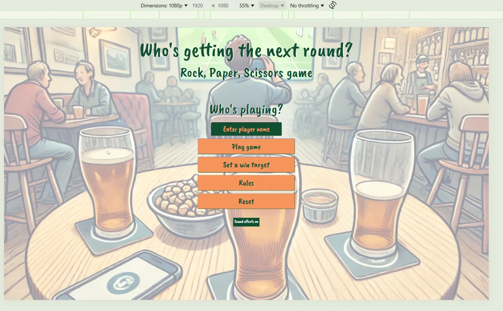
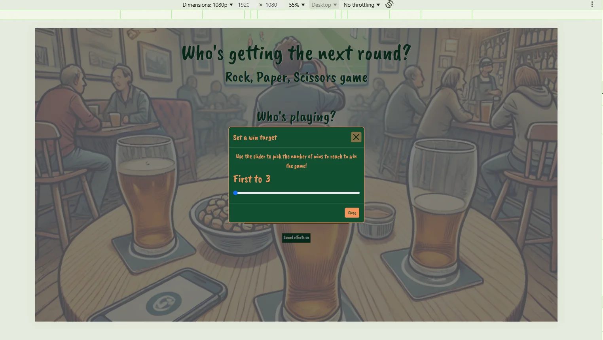
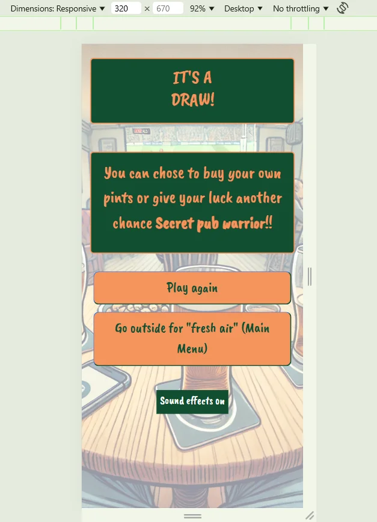
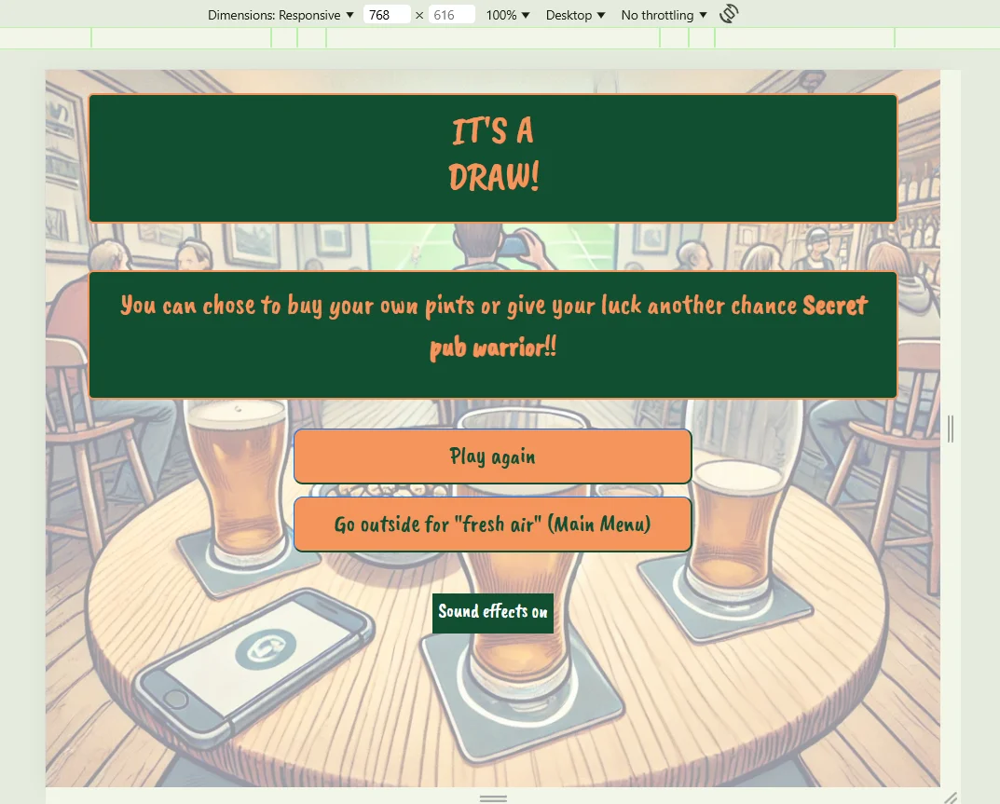
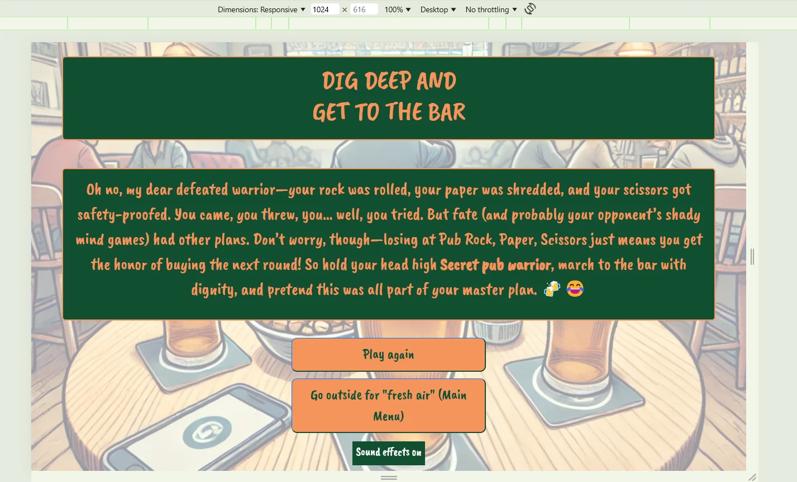
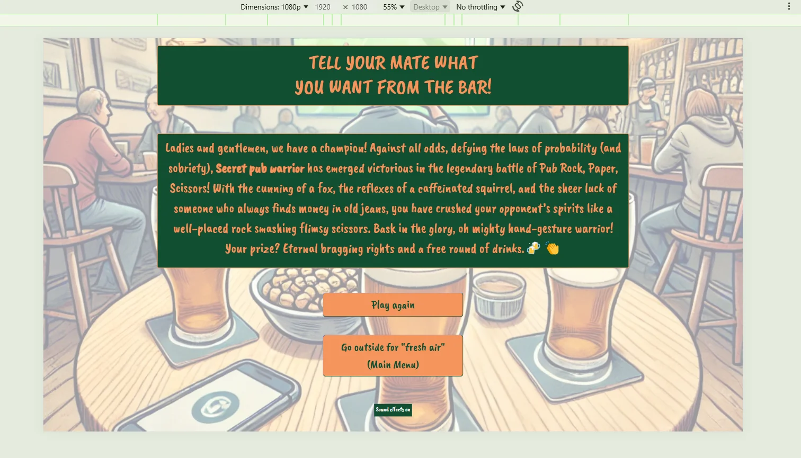
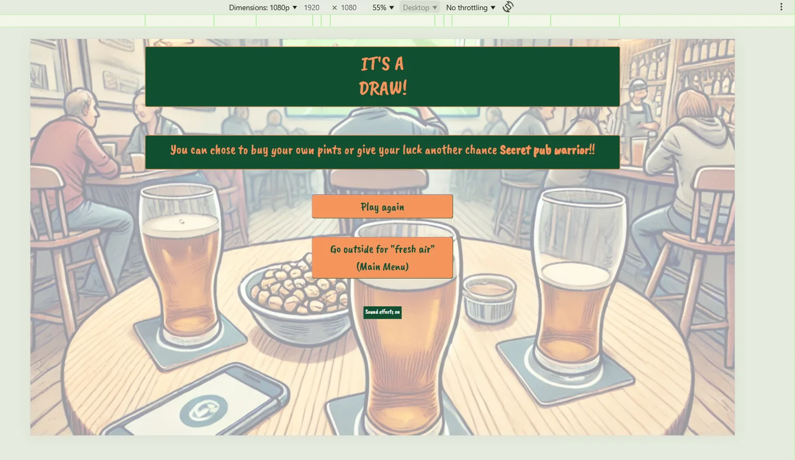

# HTML/CSS User Stories

## Main Menu

Main Menu

Main Menu GitHub User Story

 

Mobile(320px)

### Mobile (320px)

 

Tablet

### Tablet

 

Laptop

### Laptop

 

1080p Screen

### 1080p screen

## Game Page

Game Page

Game page GitHub User Story

Mobile(320px)

### Mobile (320px)

Tablet

### Tablet

Laptop

### Laptop

1080p Screen

### 1080p screen

## Set win target

Set a win target

Set a win target GitHub User Story

Mobile(320px)

### Mobile (320px)

Tablet

### Tablet

Laptop

### Laptop

1080p Screen

### 1080p Screen

## Rules

Rules

Rules GitHub User Story

Mobile(320px)

### Mobile (320px)

Tablet

### Tablet

Laptop

### Laptop

1080p Screen

### 1080p screen

## Winner/Loser/Draw pages

Winner/Loser/Draw pages

Winner/Loser/Draw pages GitHub User Story

Mobile (320px)

### Mobile (320px)
#### Winner

#### Loser

#### Draw

Tablet

### Tablet

#### Winner

#### Loser

#### Draw

Laptop

### Laptop

#### Winner

#### Loser

#### Draw

1080p Screen

### 1080p Screen
#### Winner

#### Loser

#### Draw

 

[Home](README.md#user-stories)
