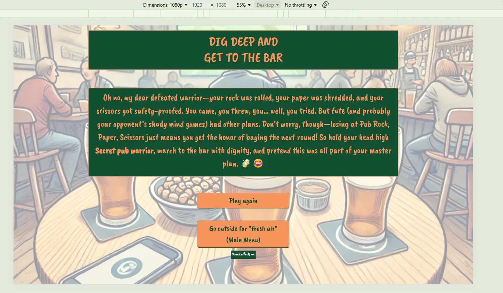

# User Stories

## Main Menu

Main Menu GitHub User Story

 
The link below will take you to the issue created for the main menu.
 

https://github.com/chloejones9464/whos-getting-the-next-round/issues/1

 

Mobile(320px)

### Mobile (320px)

 

Tablet

### Tablet

 

Laptop

### Laptop

 

1080p Screen

### 1080p screen

## Game Page

Game page GitHub User Story

 
The link below will take you to the issue created for the game page.

https://github.com/chloejones9464/whos-getting-the-next-round/issues/5

Mobile(320px)

### Mobile (320px)

Tablet

### Tablet

Laptop

### Laptop

1080p Screen

### 1080p screen

## Set win target

Set a win target GitHub User Story

 
The link below will take you to the issue created for the Set a win target modal. 

https://github.com/chloejones9464/whos-getting-the-next-round/issues/2

Mobile(320px)

### Mobile (320px)

Tablet

### Tablet

Laptop

### Laptop

1080p Screen

### 1080p Screen

## Rules

Rules GitHub User Story

 
The link below will take you to the issue created for the Rules modal. 

https://github.com/chloejones9464/whos-getting-the-next-round/issues/3

Mobile(320px)

### Mobile (320px)

Tablet

### Tablet

Laptop

### Laptop

1080p Screen

### 1080p screen

## Winner/Loser/Draw pages

Winner/Loser/Draw pages GitHub User Story

 
The link below will take you to the issue created for the Winner/loser/draw pages. 

https://github.com/chloejones9464/whos-getting-the-next-round/issues/6

Mobile (320px)

### Mobile (320px)
#### Winner

#### Loser

#### Draw

Tablet

### Tablet

#### Winner

#### Loser

#### Draw

Laptop

### Laptop

#### Winner

#### Loser

#### Draw

1080p Screen

### 1080p Screen
#### Winner

#### Loser

#### Draw

## Player name input

https://github.com/chloejones9464/whos-getting-the-next-round/issues/11

Below, I've created a screen recording that display the Player name input for all devices.

## Play game button

https://github.com/chloejones9464/whos-getting-the-next-round/issues/12

## Set a win target

https://github.com/chloejones9464/whos-getting-the-next-round/issues/13

## Rules button HTML

https://github.com/chloejones9464/whos-getting-the-next-round/issues/14

## Quit button

https://github.com/chloejones9464/whos-getting-the-next-round/issues/15

## Sound effects

https://github.com/chloejones9464/whos-getting-the-next-round/issues/22 

## Game play User stories

| User story title      | User story links           | 
| ------------- |:-------------:| 
| Rules JS      | https://github.com/chloejones9464/whos-getting-the-next-round/issues/16 | 
| Scoreboard      | https://github.com/chloejones9464/whos-getting-the-next-round/issues/17      | 
| Computer choice | https://github.com/chloejones9464/whos-getting-the-next-round/issues/18      | 
| Results display | https://github.com/chloejones9464/whos-getting-the-next-round/issues/19      | 
| Player section | https://github.com/chloejones9464/whos-getting-the-next-round/issues/20      |
| Winner/loser/draw pages | https://github.com/chloejones9464/whos-getting-the-next-round/issues/21      | 
| Reset button | https://github.com/chloejones9464/whos-getting-the-next-round/issues/23 | 

Mobile(320px)

Tablet

Laptop

1080p Screen

 

[Home (User stories)](README.md#user-stories)  
[Home (Responsiveness)](README.md#responsiveness)
