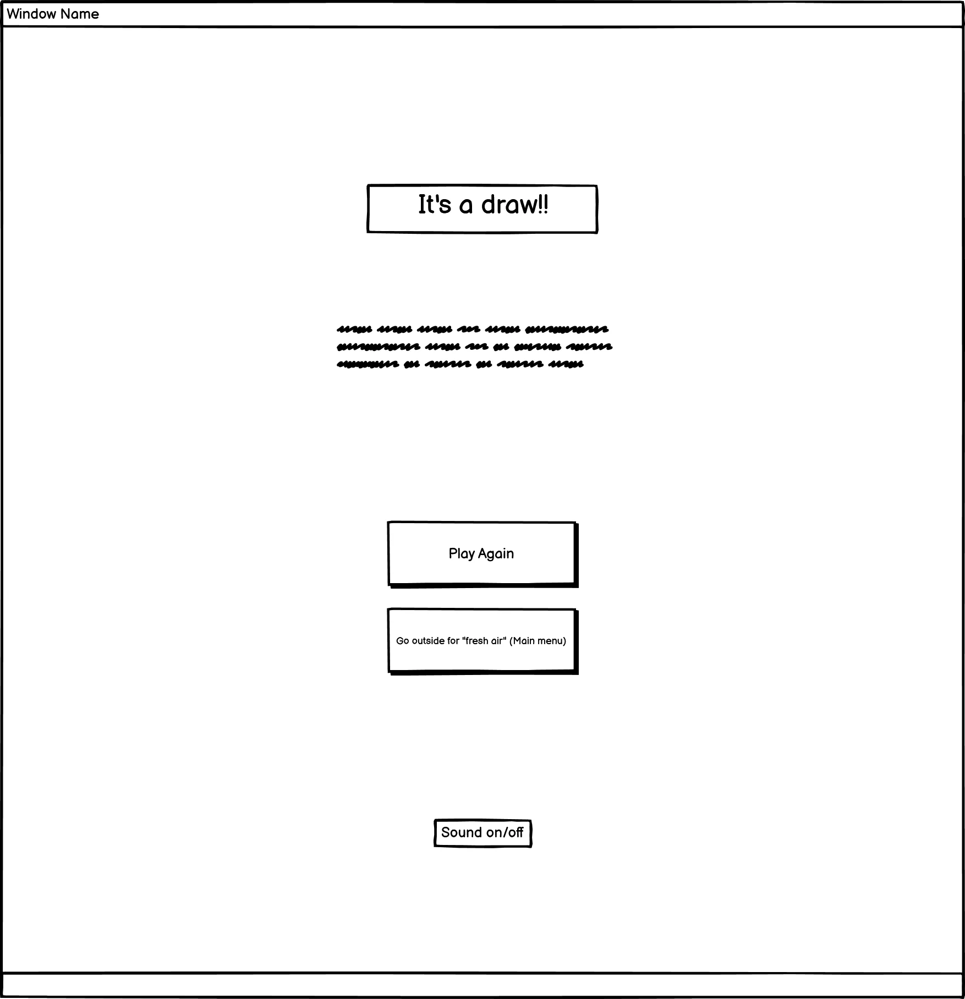

# Wireframes

## Mobile

Mobile Wireframes

#### Below you'll see I've created the frames together to ensure I keep the structure of the page the same.

## Tablet

Tablet Wireframes

Main Menu Wireframes

Game Page Wireframes

Rules Wireframes

Set a win target Wireframes

Winner Page Wireframes

Loser Page Wireframes

Draw Page Wireframes

## Laptop/1080p Screen

Laptop/1080p Screen Wireframes

Main Menu Wireframes

Game Page Wireframes

Rules Wireframes

Set a win target Wireframes

Winner page Wireframes

Loser page Wireframes

Draw page Wireframes

